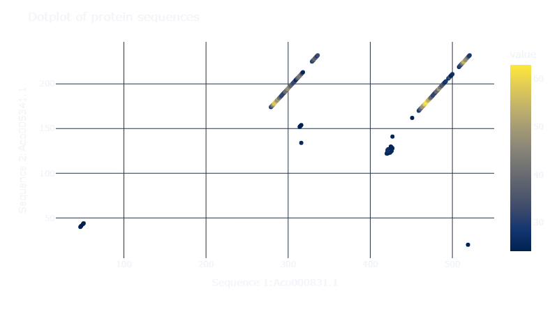

# shiny-dotplotter

This is a first attempt to create a shiny app using python. Applied on sequence comparison (particularly, generating a  dotplot from 2 fasta sequences), the point is to allow for an inteactive heatmap generation of the dotplot of 2 sequences.
> <i> The app is still under development, and the current version is a prototype can be found here: [https://raysas.shinyapps.io/dotplotter/](https://raysas.shinyapps.io/dotplotter/) 
</i>
The memo of the steps followed will be found [here in meta](./meta/readme.md).

This is an example of what the dotplot code its supposed to give (but actually interactive):  
  

### What's a dotplot?

A dotplot is a graphical method that allows the comparison of two sequences, it is a matrix where each cell represents a comparison between the two sequences. The comparison can be done via exact matches (dot=match), but this is now relaxed using windows. The idea is to slide a window over the sequences and compare the content of the window, if the content is above a certain threshold, then a dot is placed in the matrix (the windowws will be consdered similar according to a threshold). The dotplot is a useful tool to visualize the similarity between two sequences (not quantitavely, like alignment), it can be used to identify regions of similarity, like conserved regions or even some structural elements like repeats, palindromes, duplications, inversions, etc.  